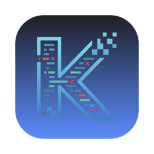

<p align="center">
  
</p>

<h1 align="center">K-Debugger</h1>

<p align="center">Android 앱에 붙어 로그·네트워크·상태를 실시간으로 들여다보는 macOS 데스크톱 디버깅 도구.</p>

<p align="center">
  <a href="https://github.com/rex-ingeni/K-Debugger/releases/latest"><b>⬇ macOS 다운로드</b></a> ·
  <a href="https://rex-ingeni.github.io/K-Debugger/">소개 페이지</a> ·
  <a href="https://rex-ingeni.github.io/K-Debugger/android.html">Android 연결 가이드</a>
</p>

---

## 다운로드 & 설치

1. [최신 릴리스](https://github.com/rex-ingeni/K-Debugger/releases/latest)에서 `.dmg`를 받는다.
2. DMG를 열어 **K-Debugger.app**을 Applications로 드래그.
3. 서명 전 단계라 첫 실행은 앱을 **우클릭 → 열기**.

## 자동 업데이트

새 버전이 나오면 앱을 켤 때 **⚙ 설정 버튼에 뱃지**가 뜬다. 설정 → **업데이트**를 누르면 앱이 새 빌드를 직접 받아 교체하고 재시작한다(무결성은 SHA-256로 대조).

---

## Android 연결 가이드

연결은 **adb**로 이뤄진다. 자세한 내용은 [연결 가이드 페이지](https://rex-ingeni.github.io/K-Debugger/android.html) 참고.

### 1. 사전 준비
- **adb 설치** — Android SDK Platform-Tools (예: `brew install android-platform-tools`)
- 기기에서 **USB 디버깅 ON** (설정 → 개발자 옵션; 개발자 옵션은 "빌드 번호" 7회 탭)
- USB 연결 후 "USB 디버깅 허용" 승인, 확인:
  ```
  adb devices
  # XXXXXXXX   device   ← 이렇게 뜨면 정상
  ```

### 2. 기기 감지
K-Debugger를 실행하면 연결된 기기를 자동 감지해 **상단 기기 선택**에 표시한다.

### 3. WebView 디버깅 ✅ *지금 동작*
앱 안 WebView를 Chrome DevTools Protocol(CDP)로 직접 디버깅한다. 별도 SDK 없이 adb만으로 동작.
```kotlin
// 대상 앱의 디버그 빌드에서
if (BuildConfig.DEBUG) {
    WebView.setWebContentsDebuggingEnabled(true)
}
```
해당 WebView 화면을 띄운 뒤, K-Debugger의 **WebView 탭**에서 타깃을 고르면 DevTools가 열린다.

### 4. 로그 · 네트워크 · 상태 (SDK 연동) 🚧 *개발 중*
앱의 로그·네트워크·Preferences/DB를 보려면 device측 **KDebugger SDK** 연동이 필요하다(플러그인 스트리밍은 개발 중).
```kotlin
// Application.onCreate() — 디버그 빌드에서만
if (BuildConfig.DEBUG) KDebugger.init(this)
```
```
# 데스크톱에서 소켓 매핑
adb forward tcp:8088 localabstract:k-debugger
```
프로토콜: 4바이트 빅엔디안 길이 헤더 + UTF-8 JSON. 릴리스 빌드에서 `init`을 부르지 않으면 no-op.

> 네트워크 인터셉터·DB 브릿지·로그 후킹은 현재 확장 지점(개발 중)이다. 지금 완전히 동작하는 연결은 **3번(WebView)**.

---

## 참고
- **Android 전용** (iOS 미지원).
- macOS 앱은 Developer ID 서명 전 단계 → 첫 실행 우클릭 열기.
